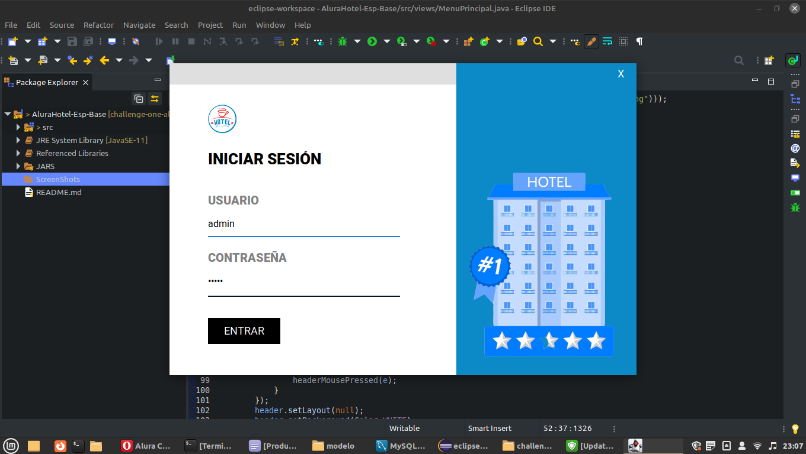
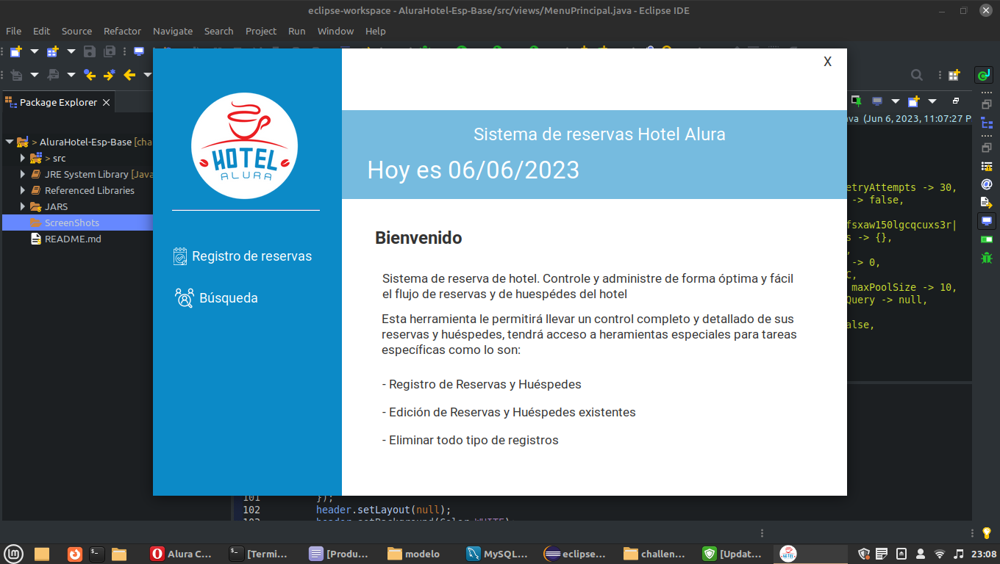
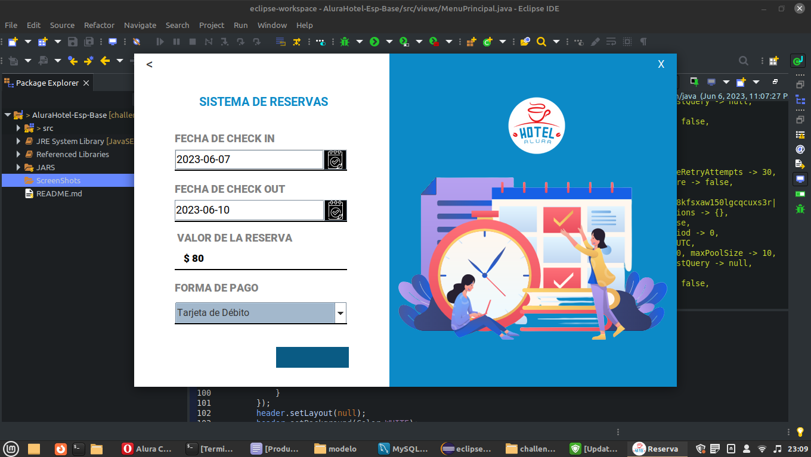
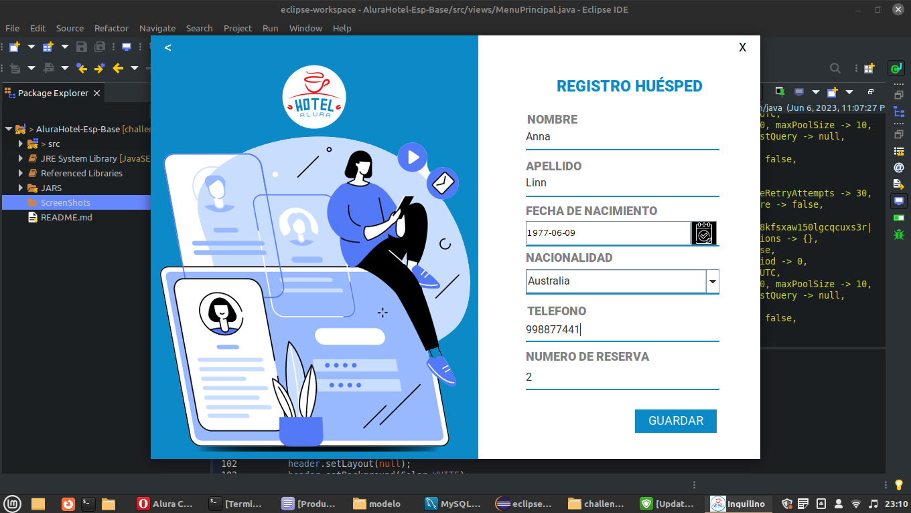
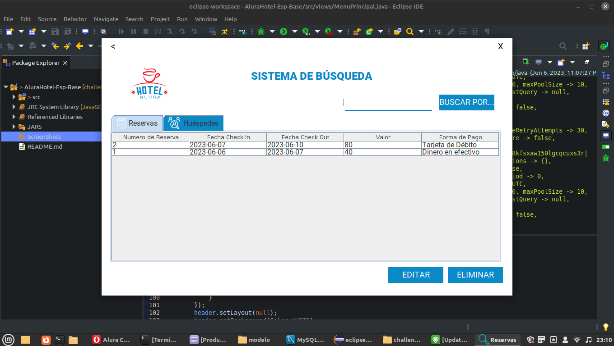
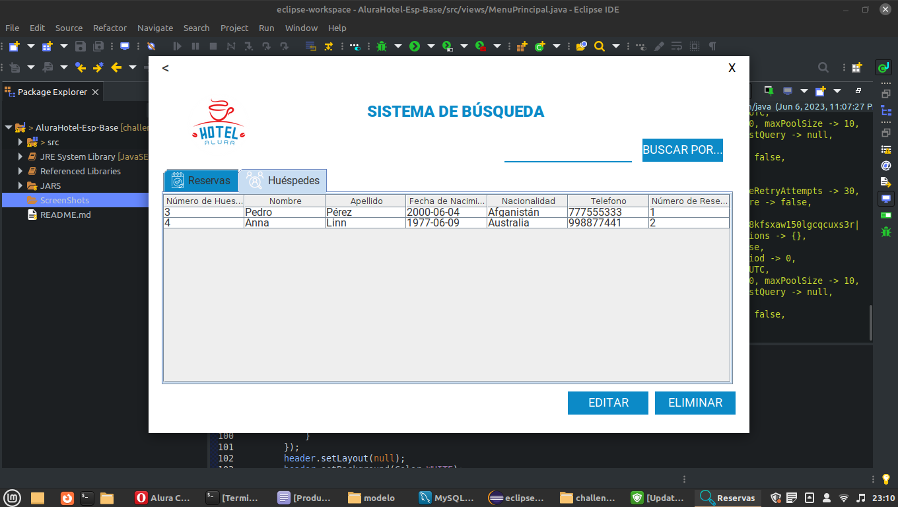

# Challenge ONE | Java | Back-end | Hotel Alura

---
##  Descripción:

El objetivo del proyecto es demostrar los conocimientos objenidos para implementar la conexión de proyectos en Java con bases de datos.

#### Marca este proyecto con una ⭐
 

## 🖥️ Tecnologías Utilizadas:

- Java versión 11
- Eclipse
- Biblioteca JCalendar
- MySql
- Plugin WindowBuilder  

---

---

#### Capturas

1 - Ventana de login. 

     

2 - Ventana de bienvenida y selección.

     

3 - Ventana de Reservas.

<

     

4 - Ventana de Registro de Huéspedes.

     

5 - Ventana de búsqueda de reservas.

     

6 - Ventana de búsqueda de huéspedes.

     

🧡 <strong>Oracle</strong> 

💙 <strong>Alura Latam</strong> 

